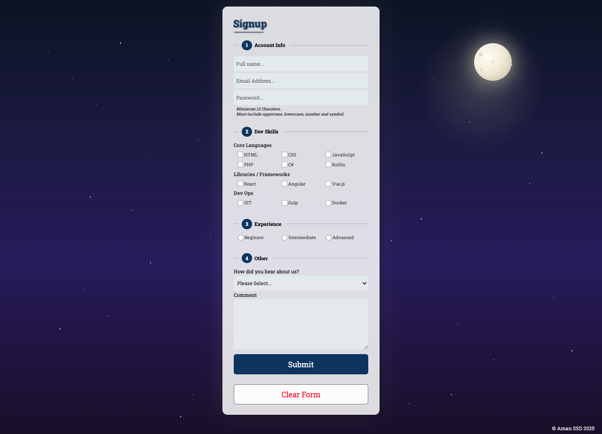

# Author name
Amandeep Singh

# GitHub url
https://github.com/Amanbcit/Formfactor.git

# Signup Form with Night Scene Background

A responsive developer signup form featuring glass-morphism design set against an immersive night sky with a realistic moon and starfield.

## Project Overview

This project is a multi-step signup form designed for developer onboarding. It collects:
- **Account Information:** Full name, email, password with validation
- **Developer Skills:** Core languages (HTML, CSS, JavaScript, PHP, C#, Kotlin)
- **Frameworks/Libraries:** React, Angular, Vue.js
- **DevOps Tools:** Git, Gulp, Docker
- **Experience Level:** Beginner, Intermediate, or Advanced
- **Additional Information:** How they heard about us, comments

### Features
- Dynamic form validation (password requires 12+ characters with uppercase, lowercase, number, and symbol)
- Conditional field display (details field appears when "Magic" or "Other" is selected)
- Glass-morphism UI design
- Fully responsive layout
- Accessible form controls with proper labels and ARIA attributes

## Screenshots

### Sunset View

- Warm gradient tones
- Soft borders & highlights
- Focus on visual warmth and readability

### Night View

- Dark background
- High-contrast text
- Soft accent colors


## How to Run Locally

### Option 1: Direct File Opening
1. Clone or download this repository
2. Navigate to the project folder
3. Open `index.html` directly in your web browser

### Option 2: Using a Local Server (Recommended)
```bash
# Using Python 3
python -m http.server 8000

# Using Node.js (http-server)
npx http-server

# Using PHP
php -S localhost:8000
```

Then open your browser and navigate to `http://localhost:8000`

### Option 3: Using VS Code Live Server
1. Install the "Live Server" extension in VS Code
2. Right-click on `index.html`
3. Select "Open with Live Server"

## Theme Notes

### Design Intent

Creates a serene, professional atmosphere through a night sky theme that evokes creativity and focus. The translucent form floats elegantly over the cosmic backdrop while maintaining excellent readability and allowing the scenery to remain visible.

### Color Palette

- **Night Sky:** Deep midnight blue (#0a1128) transitioning through indigo to rich purple (#1a0b2e)
- **Moon:** Warm cream to tan gradient (#fffef0 → #d4c5a9) with soft yellow glow
- **Primary Color:** Professional navy blue (#163c6d) for buttons and accents
- **Form Background:** Translucent white (rgba(255, 255, 255, 0.85)) with 12px backdrop blur
- **Text:** Dark grey (#1a1a1a) on light backgrounds for WCAG AA compliance

### Contrast & Accessibility

- High contrast ratios throughout for readability
- 2px focus outlines on all interactive elements
- Numbered fieldset legends guide users through the multi-step process
- Clear visual hierarchy with prominent submit button

### Gradient Usage

**1. Linear Gradient (Night Sky):**
- Direction: Top to bottom (180deg)
- Creates atmospheric depth from deep space to horizon
- Colors: #0a1128 → #1e1b4b → #2d1b69 → #1a0b2e

**2. Radial Gradient (Moon Glow):**
- Position: 80% horizontal, 20% vertical (top-right)
- Creates soft moonlight illumination
- Color: rgba(255, 255, 200, 0.15) fading to transparent

**3. Multiple Radial Gradients (Stars):**
- 50+ individual stars at varying sizes (0.5px - 1.5px)
- Creates dense, realistic starfield with depth
- Distributed across entire viewport

**4. Radial Gradient (Moon Surface):**
- Elliptical gradient from top-left creating natural illumination
- 5 crater gradients using tan/beige tones for realistic texture
- Multi-stop gradient provides dimensional appearance

### Glass-Morphism Effect

- 85% opaque background with 12px backdrop blur
- Layered shadows create depth and separation
- Subtle white border enhances glass rim appearance
- Content remains readable while showing background scene